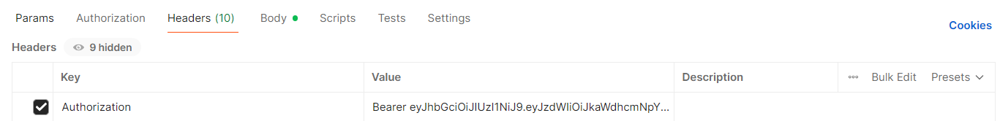

# Proyecto para gestión de usuarios.

## Ejecución.

Para correr el proyecto y hacer pruebas, se debe tener presente lo siguiente:

1. El método create user registra el usuario con los datos enviados y retorna los datos del usuario junto con el
   JWT generado, debido a que este metodo internamete hace el proceso de login cuando el email enviado no se encuentra
   registrado. Este JWT debe ser tenido en cuenta para la ejecución de los métodos privados (delete user, find user
   y update user).

- endpoint servicio create user: http://localhost:8080/api/v1/users

2. Si el usuario ya se encuentra registrado, debe acceder al servicio de login para hacer el proceso de autenticación
   y obtener el token JWT con el que se consumirán los métodos privados.

- endpoint servicio login: http://localhost:8080/login

3. Una vez logeado y obtenido el JWT, este se debe enviar en el header de las peticiones de los siguientes métodos
   en forma de Authorization bearer, así:
   
4. 
   de este modo y enviando los parámetros y/o body correspondiente (según sea el endpoint a consumir), se pueden
   hacer los consumos restantes.

- endpoint servicio find user (GET): http://localhost:8080/api/v1/users/{email}
- endpoint servicio update user (PUT): http://localhost:8080/api/v1/users/{id}
- endpoint servicio delete user (DELETE): http://localhost:8080/api/v1/users/{id}

_Nota: no hay un orden planteado para hacer estos consumos._

La documentación y forma de consumir estos endpoints se puede encontrar al ejecutar el proyecto y acceder al swagger en esta ruta: http://localhost:8080/swagger-ui.html

Las pruebas se pueden hacer desde la misma plataforma de Swagger o creando las peticiones y ejecutándolas desde cualquier
cliente rest como Postman, Insomnia, Katalon, etc.
----------------

## Requisitos de la entrega.

* Diagrama de la solución:
  
  También se puede encontrar en la ruta _src/main/resources/img/Diagrama de solucion.png_

* Script de la Base de Datos.
  Este script que define la creación de las tablas que componen la solución, se encuentra en la ruta
  _src/main/resources/schema.sql_
